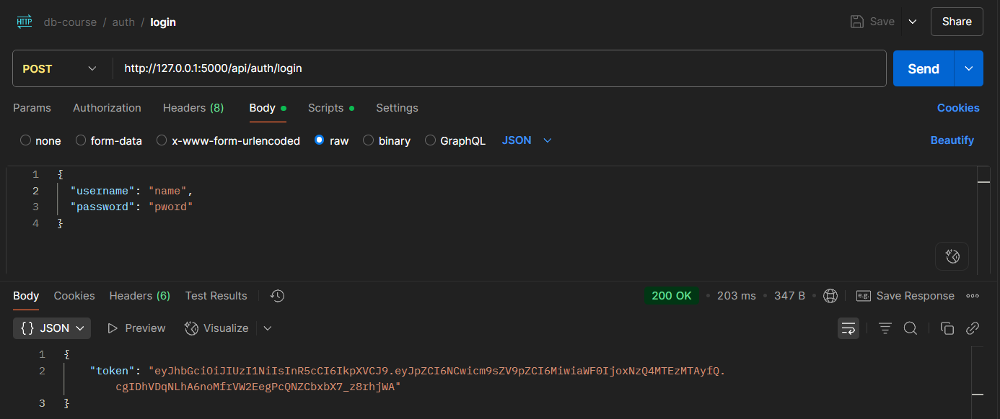
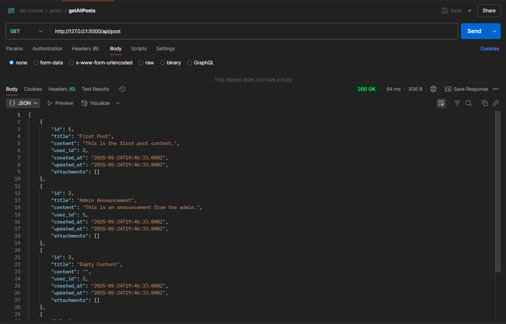
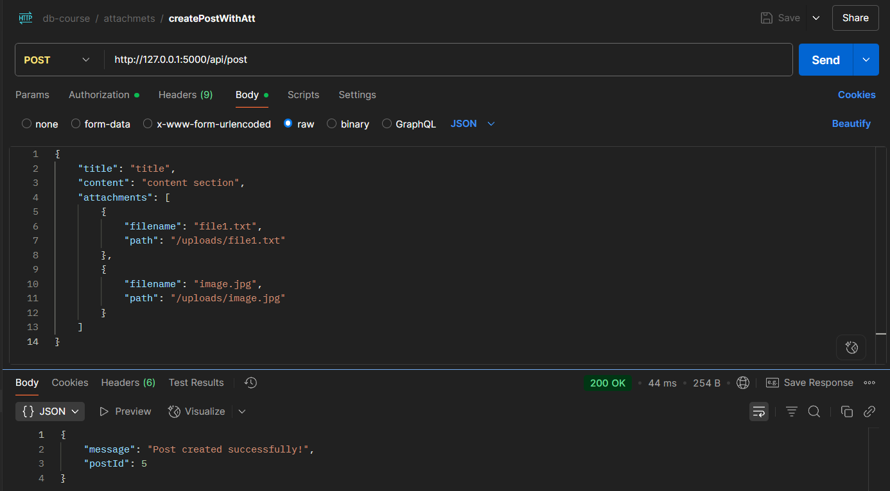
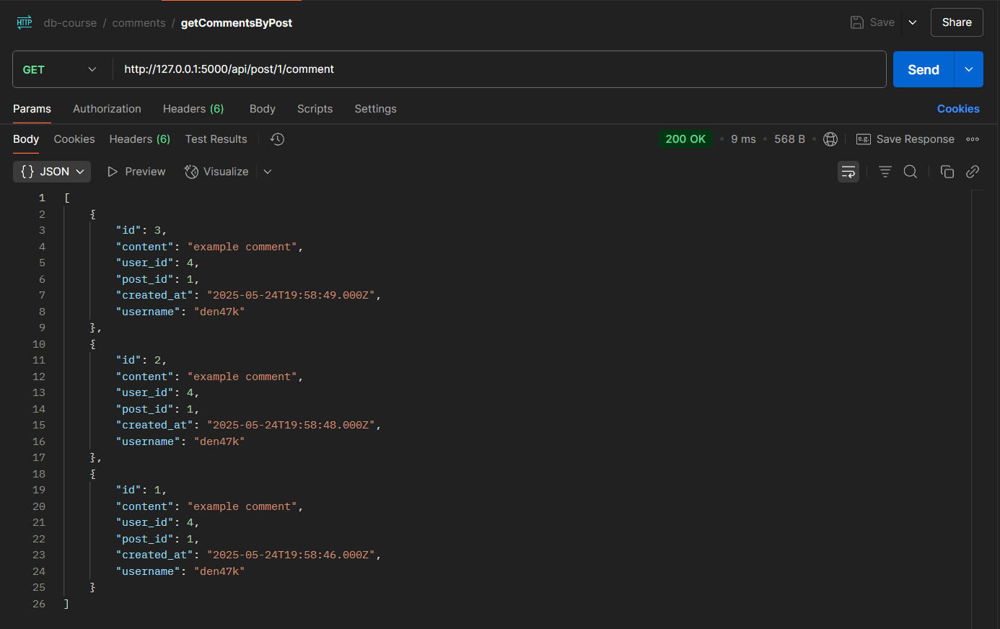

# RESTful Service Documentation

Цей документ містить огляд RESTful сервісу і способів взаємодії з ним за допомогою Postman. Огляд зролений лише для декількох ендпоінтів.

## Base URL

```
http://127.0.0.1:5000/api
```

---

## Endpoints

### 1. Login

* **URL:** `/auth/login`
* **Method:** `POST`
* **Description:** Авторизація користувача

#### Request Example

```
{
  "username": "name",
  "password": "pword"
}
```

#### Response Example



---

### 2. Get All Posts

* **URL:** `/post`
* **Method:** `GET`
* **Description:** Отримати список усіх постів.

#### Request Example

`none`

#### Response Example



---

### 3. Create New Post

* **URL:** `/posts`
* **Method:** `POST`
* **Description:** Створити новий пост.

#### Request Example

```
{
    "title": "title",
    "content": "content section",
    "attachments": [
        {
            "filename": "file1.txt",
            "path": "/uploads/file1.txt"
        },
        {
            "filename": "image.jpg",
            "path": "/uploads/image.jpg"
        }
    ]
}
```

#### Response Example



---

### 4. Get Comments By Post

* **URL:** `/post/{id}/comment`
* **Method:** `GET`
* **Description:** Отримати коментарі до посту.

#### Request Example

`none`

#### Response Example

